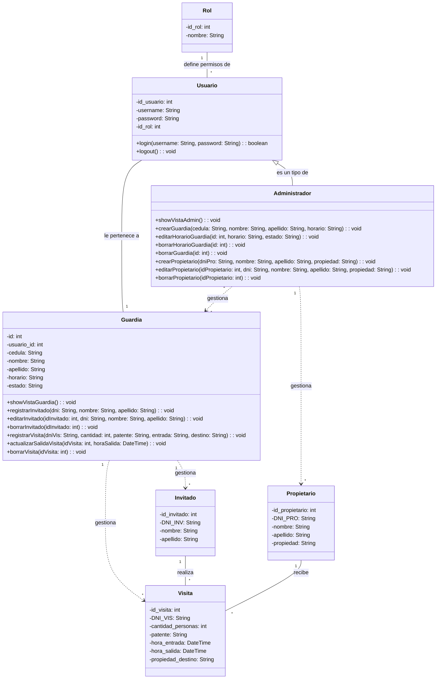

# 🏘️ Barrio MVC

Sistema web de administración barrial desarrollado de forma colaborativa utilizando arquitectura MVC, PHP y MySQL.

---

## 📌 Descripción

**Barrio MVC** es una aplicación web orientada a la gestión de barrios privados o comunidades residenciales. El proyecto fue desarrollado en equipo como práctica académica y de aprendizaje colaborativo, aplicando una arquitectura MVC para mantener una estructura organizada, escalable y fácil de mantener.

La plataforma permite administrar información relacionada con vecinos, accesos, reclamos y diferentes funcionalidades típicas de un sistema barrial.

El objetivo principal del proyecto fue reforzar conocimientos sobre:

* Arquitectura MVC
* Desarrollo backend con PHP
* Manejo de bases de datos relacionales
* Organización modular del código
* Trabajo colaborativo con Git y GitHub
* Separación de responsabilidades
* Buenas prácticas de desarrollo web

---

## 🚀 Características principales

* Gestión de vecinos
* Sistema de reclamos
* Administración de accesos
* Arquitectura MVC organizada
* Base de datos MySQL
* Sistema modular y escalable
* Manejo de rutas y controladores
* Separación entre lógica, vistas y modelos

---

## 🛠️ Tecnologías utilizadas

| Tecnología    | Uso                                      |
| ------------- | ---------------------------------------- |
| PHP           | Backend y lógica de la aplicación        |
| MySQL         | Base de datos relacional                 |
| HTML5         | Estructura del frontend                  |
| CSS3 / SCSS   | Estilos y diseño visual                  |
| JavaScript    | Interactividad del cliente               |
| Gulp          | Automatización de tareas                 |
| Node.js / npm | Gestión de dependencias                  |
| Git & GitHub  | Control de versiones y trabajo en equipo |

---

## 📂 Estructura del proyecto

```bash
Barrio-MVC/
│
├── controllers/
├── models/
├── views/
├── public/
├── includes/
├── classes/
├── src/
├── gulpfile.js
├── package.json
├── composer.json
└── README.md
```

---

## ⚙️ Requisitos

Antes de ejecutar el proyecto, asegurate de tener instalado:

* PHP 7.4 o superior
* MySQL
* Node.js
* npm
* Composer
* Git

---

## ▶️ Instalación y ejecución

### 1️⃣ Clonar el repositorio

```bash
git clone https://github.com/matybdev/Barrio-MVC.git
```

---

### 2️⃣ Ingresar al proyecto

```bash
cd Barrio-MVC
```

---

### 3️⃣ Instalar dependencias

```bash
npm install
composer install
```

---

### 4️⃣ Ejecutar Gulp

```bash
gulp
```

---

### 5️⃣ Configurar la base de datos

Crear una base de datos en MySQL e importar los archivos SQL correspondientes.

Luego configurar las credenciales de conexión según el entorno local.

---

### 6️⃣ Levantar el servidor local

Desde la carpeta `public/` ejecutar:

```bash
php -S localhost:3000 -t public
```

---

### 7️⃣ Abrir en el navegador

```text
http://localhost:3000
```

---

## 👥 Trabajo en equipo

Este proyecto fue desarrollado de manera grupal utilizando Git y GitHub para la organización y control de versiones.

Durante el desarrollo se trabajó en:

* División de tareas
* Organización por módulos
* Uso de ramas para nuevas funcionalidades
* Integración de cambios mediante Git
* Resolución colaborativa de problemas

---

## 📖 Objetivos del proyecto

* Aplicar el patrón MVC en un proyecto real
* Mejorar la organización del código
* Practicar trabajo colaborativo
* Implementar operaciones CRUD
* Conectar una aplicación web con MySQL
* Comprender el flujo completo de una aplicación web

---

## 🔮 Posibles mejoras futuras

* Sistema de autenticación
* Roles y permisos
* Panel administrativo avanzado
* API REST
* Notificaciones en tiempo real
* Responsive design mejorado
* Validaciones más robustas
* Tests automatizados

---

## Diagrama de clases

---


## 👨‍💻 Repositorio

[Barrio MVC en GitHub](https://github.com/matybdev/Barrio-MVC?utm_source=chatgpt.com)
